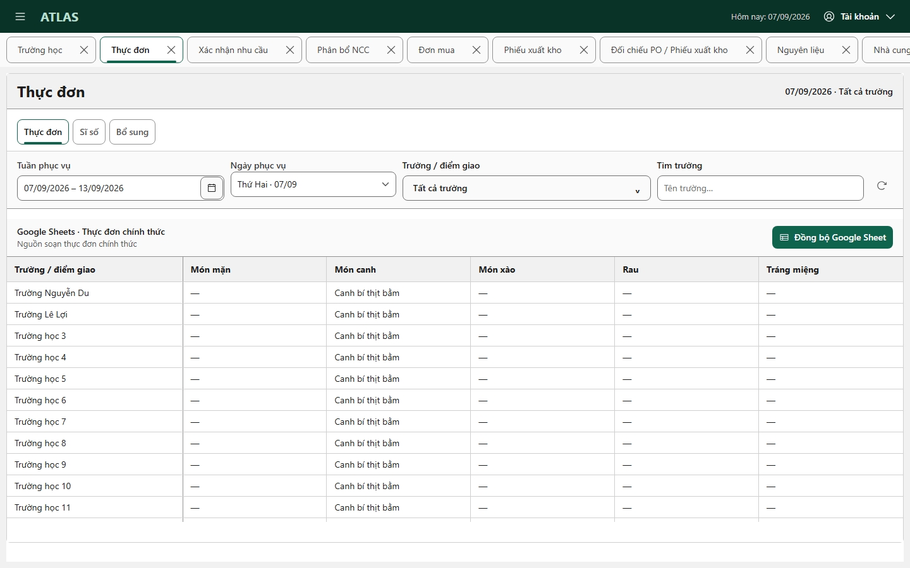
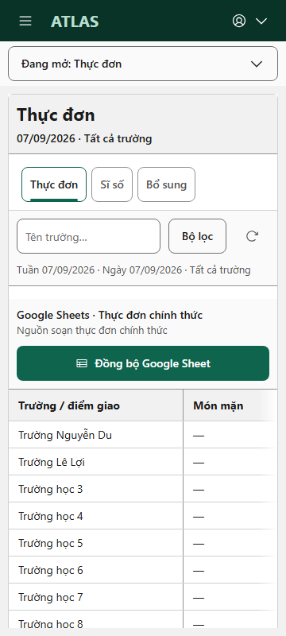

# Tab border legibility — 8 October 2026

Owner-approved presentation change: rounded 8px tab corners, neutral boundaries, accent selected outlines, inset 3px selected underlines with rounded ends, neutral hover and visible keyboard focus. Scope is the workspace shell and shared primary/secondary task-tab styles. No handlers, business contracts, API calls, permissions or state ownership changed.

## Verification

- Local fixture review of the production workbenches at 1920×1080, 1440×900, 1366×768, 650×900 and 360×800: all eleven owners reachable; no document overflow or browser errors.
- Rendered CSS checks: 8px corners on all tabs, 1px resting boundaries, inset 3px selected underlines, distinct selected/hover treatment and at least 2px keyboard focus outlines. All tab tiers reuse the shared rounded marker; secondary tabs suppress Chakra's full-width marker.
- Workspace Home/End switching and the narrow open-owner selector passed. Internal source selection retains its existing heading-focus handoff. Narrow targets retain 44px height.
- 71 focused system/shell/persistent-workspace/handoff tests passed. UI boundary, changed-file formatting and diff whitespace checks passed.
- UI art direction and an independent visual finish review passed with no tab-scope findings. Full frontend validation runs in GitHub Actions; hosted and real staff usage are not claimed by this fixture review.

## Security and rollback

No backend, RLS, data, migration or dependency changes. Revert this frontend/docs change to restore the previous presentation; no data rollback is required. Product review and merge remain separate.
